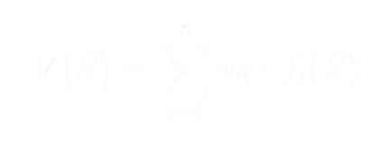
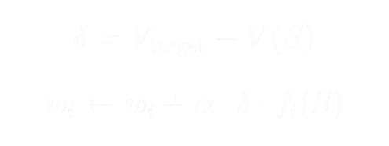
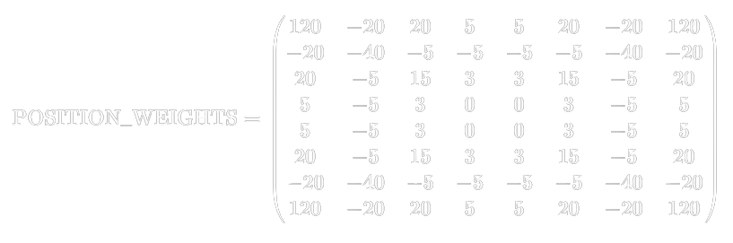

# Reversi (Othello)

Hello!

This project, **Reversi** (also known as Othello), is a robust implementation of the classic 8x8 board game developed in Java. It is a continuation of my work from a previous programming course and now serves as a platform to integrate and test various Artificial Intelligence strategies.
<p align="center">
  
</p>
---

## Game Modes and Features

Reversi currently supports the following modes:

* **Human vs. Human:** Classic two-player mode.
* **Human vs. Bot:** Play against one of several AI opponents, each with a unique personality and strategic depth.

---

## The Bots: AI Personalities

The 'Human vs Bot' mode features four distinct opponents. Their difficulty ranges from purely random play to an advanced minimax search agent.

| Bot Name | Strategy / Description                                                                                                                                                            | Difficulty | Key AI Technique |
| :--- |:----------------------------------------------------------------------------------------------------------------------------------------------------------------------------------|:-----------| :--- |
| **DumbBot** | A basic strategic bot. It **prioritizes corner positions** (A1, A8, H1, H8) due to their high value. If no corner is available, it makes a random move.                           | Easy       | Corner Prioritization  |
| **MapleBot** | A more refined strategic bot. It chooses the move that results in the **highest combined score** of flipped pieces and a static **positional weight** for the newly placed piece. | Medium     | Static Evaluation Function |
| **CastellaBot** | The second most challenging opponent. It uses an advanced **game-tree search algorithm** to look several moves ahead.                                                             | Hard       | Minimax with Alpha-Beta Pruning |
| **MomijiManjuBot** |  The most challenging opponent. It evaluates moves using a **learned value function**, trained via **temporal-difference reinforcement learning** over multiple board features. | Difficult | Temporal-Difference Reinforcement Learning |

---
## Reinforcement Learning Agent: MomijiManjuBot Explained

The **MomijiManjuBot** is the most advanced opponent in the system. Instead of relying on a fixed search depth or hand-tuned heuristics, it uses a **reinforcement learning approach** to learn how to evaluate board positions from experience.

### 1. Value-Based Reinforcement Learning (TD Learning)

MomijiManjuBot models the game as a sequence of states and learns a **state-value function**:

<p align="center">
  
</p>


where:
- \($f_i(S)$)are hand-designed features extracted from the board state
- \( $w_i$) \) are learned weights

The bot is trained using **Temporal-Difference (TD(0)) learning**, where weights are updated based on the difference between the predicted value of a state and a target value derived from future outcomes.

Training is performed through repeated self-play games against progressively stronger opponents, allowing the bot to improve its evaluation over time.

---

### 2. Training Process and Learning Signal

During training, MomijiManjuBot plays full games of Reversi and receives a **terminal reward** at the end of each game:

- **+1** for a win
- **−1** for a loss
- **0** for a draw

After a game ends, the bot updates its weights by backing up this final reward through the visited states using the TD error:

<p align="center">
  
</p>

where $\mathbf{\alpha}$ is the learning rate.  
This allows the bot to gradually learn which board features contribute to winning outcomes.

---

### 3. Feature-Based Board Evaluation

Instead of a static evaluation function, MomijiManjuBot evaluates board states using a **learned feature representation**, including:

- **Piece Difference:** Normalized difference in disc count
- **Mobility Difference:** Difference in available legal moves
- **Corner Control:** Ownership of the four corners
- **Frontier Discs:** Difference in discs adjacent to empty squares
- **Risky Squares:** Occupancy of corner-adjacent X- and C-squares

The relative importance of these features is determined automatically during training through weight updates.

---

### 4. Action Selection (After Training)

Once training is complete, MomijiManjuBot plays deterministically:

- It simulates each legal move
- Evaluates the resulting board state using the learned value function
- Selects the move with the highest estimated value

Unlike CastellaBot, **MomijiManjuBot does not perform deep game-tree search**. Instead, it relies on its learned evaluation to make strong decisions based on experience.

---

### 5. Key Difference from CastellaBot

| CastellaBot | MomijiManjuBot |
|------------|----------------|
| Searches ahead using Minimax | Evaluates states using learned values |
| Fixed evaluation function | Learned evaluation function |
| No learning | Improves through training |
| Strong tactical play | Strong strategic generalization |

---
---

## GameTree-Search Algorithm: CastellaBot Explained

The **CastellaBot** uses core game AI techniques to determine the best move, serving as the strongest opponent in the current version.

### 1. Minimax Search with Alpha-Beta Pruning

The bot explores a "game tree" of possible moves and counter-moves using the **Minimax** algorithm. It searches to a defined depth (currently set to **3 moves** ahead, using `SEARCH_DEPTH = 3`), assuming optimal play from both sides.

The search is made efficient by **Alpha-Beta Pruning**, an optimization technique that dramatically reduces the number of board states that need to be evaluated by eliminating branches of the game tree that are guaranteed not to lead to the optimal outcome.

### 2. Board Evaluation Function

Since the bot cannot search to the end of the game, it uses a weighted evaluation function to assess the "goodness" of a board state:

$$
\text{Score} = (10 \times \Delta \text{Piece Count}) + (5 \times \Delta \text{Mobility}) + \text{Position Score}
$$

* **$\Delta$ Piece Count:** The difference in the number of pieces (Player - Opponent).
* **$\Delta$ Mobility:** The difference in the number of valid moves (Player - Opponent).
* **Position Score:** A score based on the static position weights of pieces using the matrix below.

### 3. Positional Weights

The strategic value of each board square is determined by the `POSITION_WEIGHTS` matrix used by MomijiManjuBot:

<p align="center">
  
</p>

This matrix heavily favors corners (120) and penalizes adjacent squares (e.g., -20, -40).

---

## Getting Started

These instructions will guide you on how to clone the repository and run the Reversi program on your local machine.

### Prerequisites

You will need the following software installed on your system:

* **Java Development Kit (JDK):** Version 8 or higher.
* **Git:** To clone the repository.

### Installation

1.  **Clone the Repository**

    Use Git to clone the project to your local machine:
    ```bash
    git clone [YOUR-REPOSITORY-URL]
    cd reversi-project-directory # Replace with your actual directory name
    ```

2.  **Locate the Source Files**

    The source files for the game are expected to be within a `course/reversi` package structure inside the project directory.

---

## How to Run the Program

### Option 1: Command Line (Linux/macOS/Windows)

1.  **Compile the Source Files**

    From the root directory of the project, compile all Java files.
    ```bash
    # Ensure you are in the directory containing the 'course' folder
    javac course/reversi/*.java
    ```

2.  **Run the Main Class**

    Execute the program by running the main entry point (assuming it is `Reversi`):
    ```bash
    java course.reversi.Reversi
    ```

### Option 2: Using an IDE

1.  **Import the Project**
    * Open your IDE (IntelliJ, Eclipse, etc.).
    * Select **File** $\rightarrow$ **Open** or **Import Project**.
    * Navigate to the cloned directory and select it.

2.  **Run the Main Configuration**
    * Locate the main class file (`Reversi.java` or similar) in the `course.reversi` package.
    * Right-click on the file and select **Run**.

---

### Option 3: Using the JAR file

1. Clone this repository 
    ```bash
    git clone https://github.com/Gil-gil-glitch/Reversi.git
    ```
2. Navigate to the output folder and download the jar file
3. Right-click on the jar file and it should run

## Future Plans (AI Integration)

The plan is to continue developing and testing other **learning agents** (particularly Reinforcement Learning or more advanced search algorithms) that I have learned in my Artificial Intelligence coursework to further enhance the bot's capabilities and explore different AI approaches to gameplay.
